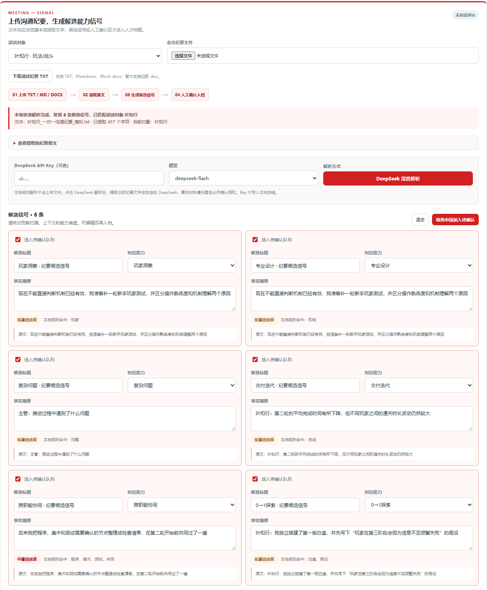
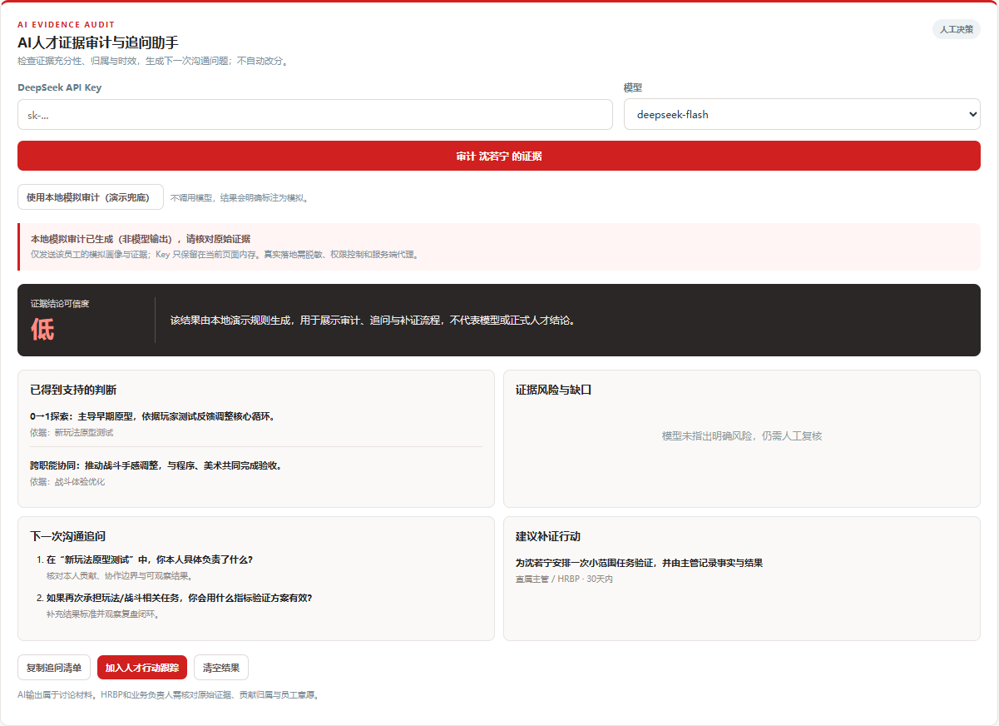

# AI 交互记录｜网易 MMO 策划人才盘点（面试方案）

> 用途：作为作业四的附加材料，说明关键 prompt、使用的 skill / 工作流，以及候选人如何保留判断、核验 AI 输出并完成交付。本文只摘录关键节点，不等同于完整对话导出。

## 1. 使用 AI 的目标与边界

- 目标：在限时作业中，把一个 HR 场景命题转化为可交互网页、网页演示文稿和答辩材料。
- AI 承担：资料检索、结构发散、前端代码辅助、模拟数据构造、版式生成、检查清单与测试。
- 候选人承担：问题定义、业务取舍、功能优先级、品牌语境、AI 使用边界、最终内容核验。
- 数据边界：系统内姓名、项目名、事件和指标均为虚构模拟，不代表网易内部情况；未向模型上传真实员工信息。

## 2. 关键交互节点

| 阶段 | 关键 prompt / 反馈摘录 | AI 的作用 | 候选人保留的判断 |
|---|---|---|---|
| 定义问题 | “结合网易历史背景、公司文化，分析命题四可以从哪些视角上手。” | 发散传统人才盘点、MMO 策划岗位和连续机制视角 | 不做通用九宫格展示，聚焦“老项目孵化新项目”的人才决策 |
| 确定交付 | “希望定制化程度高，能上传数据、查看诊断报告，用 Web Coding 搭网页。” | 把概念框架转成信息架构与页面功能 | 选择网页原型而非纯 PPT，要求现场可操作 |
| MMO 定制 | “MMO 游戏策划团队的人才画像跟其他团队有什么不一样？” | 拆分系统/数值、玩法/战斗、内容/叙事、活动/运营 | 共同能力底座 + 岗位方向 + 项目阶段，不使用一把尺子 |
| 连续盘点 | “如何更频繁、更轻量地做到人才追踪？” | 设计事件触发、月度轻看、季度校准、行动复查 | 高频不等于反复评分；最小记录单位是事实与来源 |
| 输入方式迭代 | “仅靠网页输入文字太传统，希望上传 TXT 或 Word 会议纪要自动解析。” | 增加文件读取、候选信号抽取和人工确认流程 | 未经人工确认的候选信号不能进入人才档案 |
| AI 场景选择 | “基础信号抽取、智能组队、发展计划、团队风险都可做；本次先主做 AI 人才证据审计和追问助手。” | 对多个生成式 AI 模块进行优先级收敛 | 选择低风险、高解释性的证据审计，不做自动人才定级 |
| 视觉纠偏 | “整体用网易红；先按瑞士风做；封面不需要生成图片。” | 使用网页 PPT skill 和网格版式完成视觉实现 | 品牌语境、主色、封面克制和截图实证由候选人明确 |
| 质疑与核验 | “四级评分有什么依据？模拟姓名和项目名从哪里来？” | 补充等级设计与模拟数据说明 | 主动识别“看起来合理但来源不清”的 AI 输出，要求明确边界 |
| 汇报重构 | “问题—架构—网页实例—未来—个人复盘。” | 将产品页面、讲稿备注和演示时长组合成 11 页叙事 | 强调自己的判断如何改变产品，而非只展示 AI 产物 |

## 3. 使用的 skill 与工作流

1. **瑞士风网页 PPT skill**：使用登记版式、演讲者视图、页面备注与时长校验；主色根据面试语境调整为网易红。
2. **Web Coding 工作流**：HTML / CSS / JavaScript 静态原型；模拟数据保存在浏览器；GitHub Pages 部署。
3. **网页截图工作流**：用本地无头浏览器加载真实原型，截取决策总览、连续信号、证据审计、组队和诊断报告，再嵌入汇报页面。
4. **质量校验**：校验页面 ID、讲稿备注、计划时长、瑞士版式登记、图片槽位与本地资源；浏览器逐页渲染检查。
5. **DeepSeek 接口核验**：依据官方文档核对 `https://api.deepseek.com/chat/completions`、`deepseek-flash`、`deepseek-v4-pro` 和 JSON Output；因静态网页可能受到跨域或现场网络影响，增加明确标注的本地模拟审计兜底。

## 4. 代表性工作流

```text
题目拆解
  → 传统盘点问题与 MMO 情境假设
  → 人才画像、证据、决策、行动四层架构
  → 模拟数据与网页原型
  → 用户逐轮质疑与功能纠偏
  → AI 证据审计重点模块
  → 网页截图、汇报重构和演讲备注
  → 静态校验、浏览器渲染、GitHub Pages 部署
```

## 5. AI 输出的人工核验规则

- 不把缺少证据解释为能力不足。
- 不把团队结果直接归因给个人。
- 不把 AI 生成的分数、标签或建议用于晋升、淘汰和任用决定。
- 每项证据保留来源、日期、贡献归属和人工确认状态。
- 模拟内容必须明确标注，不把虚构姓名、项目和权重描述为网易真实做法。
- API Key 不进入仓库、不写入本地持久化；真实落地需要服务端代理和权限控制。

## 6. 候选人的纠偏与反思

做得较好：持续把 AI 的通用答案拉回 MMO 业务语境；主动要求文件输入、连续信号和证据审计；质疑评分依据与模拟命名；对视觉和信息层级做出明确取舍。

仍需改进：在开发前更早锁定成功指标与汇报叙事；使用真实匿名样本校准等级和权重；邀请业务负责人、HRBP 与员工做可用性测试；补齐生产环境的服务端、权限、脱敏、日志和模型评估。

## 7. 交付物索引

- 人才盘点系统：`index.html`
- 网页演示文稿：`presentation/index.html`
- 汇报截图：`presentation/images/`
- 模拟导入材料：`sample-data/`
- 答辩题库：`答辩题库.md`
- 线上入口：<https://drs1023.github.io/talent-review/>

## 8. 原型与 AI 模块截图

### 连续信号：上传纪要并生成候选能力信号



### AI 人才证据审计与追问助手（模拟输出）




